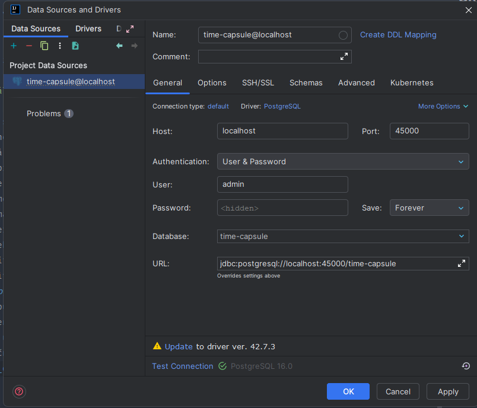
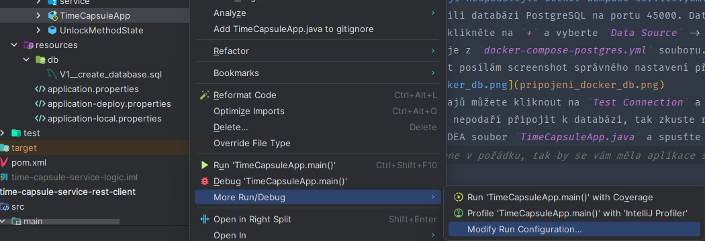
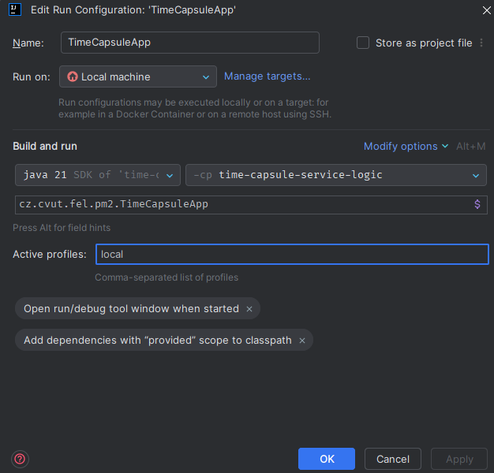
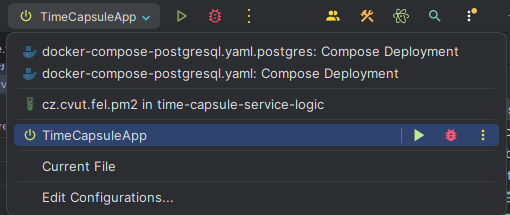

## Time Capsules
Time Capsules je moderní webová aplikace, která uživatelům umožňuje vytvářet, sdílet a objevovat časové kapsle. Uživatelé mohou ke svým kapslím přiřazovat geolokace, zobrazovat je na mapě a interagovat s kapslemi ostatních uživatelů v dynamickém a intuitivním rozhraní.

## Struktura projektu
Projekt je postaven na moderním technologickém stacku, který zajišťuje škálovatelnost, výkon a snadnou údržbu. Níže je přehled struktury projektu:

## Frontend
- Framework: React.js
- Styling: Tailwind CSS
- Hosting: Vercel
- Popis:
Frontend aplikace se stará o uživatelské rozhraní a logiku na straně klienta. Využívá React.js pro dynamické vykreslování a správu stavu aplikace a Tailwind CSS pro rychlý vývoj UI. Mezi funkce patří vytváření kapslí na základě geolokace, mapové rozhraní a responzivní design.

## Backend
- Framework: Spring Boot
- Hosting: Oracle Cloud
- Popis:
Backend aplikace slouží jako API vrstva, která poskytuje endpointy pro práci s kapslemi (např. vytvoření, zobrazení nebo smazání kapsle). Backend zajišťuje zpracování dat a bezpečnou komunikaci s databází.

## Databáze
- Typ databáze: PostgreSQL
- Hosting: Neon Console
- Popis:
Databáze ukládá všechny informace o časových kapslích, jejich geolokacích, uživatelských účtech a dalších metadatech. Neon Console poskytuje robustní a snadno spravovatelnou platformu pro PostgreSQL.

Děkujeme za váš zájem o projekt Time Capsules! 🎉

## Návod k lokálnímu vývoji BE

1. Nainstalujte si Docker Desktop pro Windows nebo Docker pro Linux.
2. Pokud ještě nemáte Intellij IDEA, nebo máte starou verzi, tak si upgradujte na nejnovější verzi (aktuálně 2024.2.4).
   1. IDEA se dá updatovat přímo z vývojového prostředí, v pravém horním rohu je žlutá ikona se šipkou.
3. Ke spuštění projektu potřebujete nejnovější LTS (Long-term support) Java verzi - JDK21.
    1. Stiskněte zkratku <kbd>CTRL</kbd>+<kbd>SHIFT</kbd>+<kbd>ALT</kbd>+<kbd>S</kbd>.
    2. V levém menu vyberte `Project` -> `Project SDK` a zvolte `21 (java version "21")`.
    3. Pokud nemáte tuto verzi, tak klikněte na `Download JDK` a stáhněte si ji, např. od Amazonu, je to jedno.
4. Spusťte Docker Desktop, nebo na Linux službu Docker.
5. V rootu projektu klikněte pravým tlačítkem na `docker-compose-postgres.yaml` a spusťte ho.
   Pokud spouštíte jakýkoliv docker-compose soubor poprvé, tak se zobrazí konfigurace Docker v IDEA. 
   Mělo by stačit kliknout na tlačítko `OK`.
   > ⚠️ Při BE vývoji nespouštějte docker-dompose-service.yaml! Tento soubor je pro produkční použití na serveru, spouští aplikaci, připojuje se k online databázi a využívá jiných environment variables. 
6. Tímto jste spustili databázi PostgreSQL na portu 45000. Databázi si můžete automaticky připojit z vývojového prostředí IDEA pomocí tlačítka `Database` na pravém boku IDE.
    1. K připojení klikněte na `+` a vyberte `Data Source` -> `PostgreSQL`.
    2. Využijte údaje z `docker-compose-postgres.yml` souboru.
    3. Pro stručnost posílám screenshot správného nastavení připojení databáze:
    
    4. Po zadání údajů můžete kliknout na `Test Connection` a pokud vše proběhne v pořádku, tak na `Apply` a `OK`.
    5. Pokud se vám nepodaří připojit k databázi, tak zkuste restartovat IDEA, nebo zkuste restartovat Docker Desktop. Předtím ověřte, zdali se vám vytvořil kontejner s databází.
7. Nyní najděte v IDEA soubor `TimeCapsuleApp.java` a klikněte na něj pravým tlačítkem. Soubor se nachází v `time-capsule-service-logic/src/main/java/cz/cvut/fel/pm2/TimeCapsuleApp.java`

    

8. Postupujte podle screenshotu a nastavte do Active Profiles `local`. Poté klikněte na OK.

    

9. Spusťte aplikaci kliknutím na zelené tlačítko `Run 'TimeCapsuleApp'` nahoře v aplikaci. Pokud se nezobrazí, najdete ho ve výběru, viz screenshot.

    

10. Tímto jste spustili BE aplikaci a můžete ji testovat pomocí Postmanu a také ji můžete provolávat z FE aplikace po napojení.

> V případě jakýchkoliv problémů se mi ozvěte, rád pomohu.